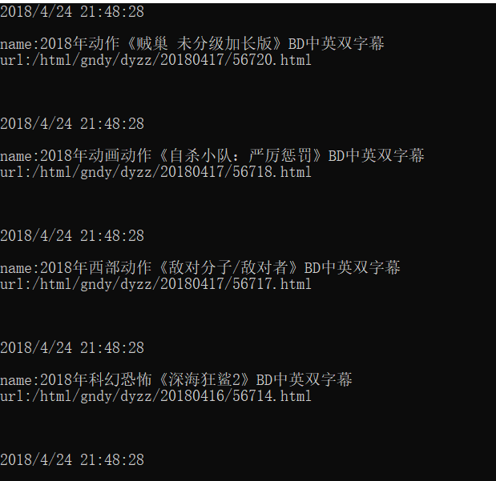

# DonetSpider
一个基于.net的爬虫，没有什么先进技术。全凭自己对于前端页面的理解，使用http请求获取html的数据，然后使用html解析工具进行解析，来获取自己想要的内容。

## 简单例子

```
 static void Main(string[] args)
        {
            DonetSpider.SaveMessage save = SaveMessage;
            SpiderConfig config = new SpiderConfig
            {
                MainUrl = "http://www.dytt8.net/html/gndy/dyzz/index.html",
                HttpConfig = new HttpConfig
                {
                    Timeout = 20000
                },
                Query = new HtmlQuery {
                    Query = "div.co_content8",
                    Children = new HtmlQuery {
                        Query = "table"
                    }
                },
                Select = new List<SelectQuery> {
                    new SelectQuery{
                        Query = new HtmlQuery{
                            Query ="a.ulink"
                        },
                        ResultKey = "name",
                        Attribute = "html"

                    },
                    new SelectQuery{
                        Query = new HtmlQuery{
                            Query = "a.ulink"
                        },
                        ResultKey = "url",
                        Attribute = "href"
                    }
                },
                NextPage = new NextPage {
                     next = new NextPageByNext {

                    }
                }
            };
            Spider s = new Spider(config, save);
            s.Start();
            Console.WriteLine("完毕");
            Console.ReadLine();
        }
        public static void SaveMessage(Dictionary<string, string> message)
        {
            Console.WriteLine(DateTime.Now.ToString());
            Console.WriteLine();
            foreach (var d in message) {
                Console.WriteLine(string.Format("{0}:{1}", d.Key, d.Value));
            }
            Console.WriteLine();
            Console.WriteLine();
            Console.WriteLine();

        }

```
